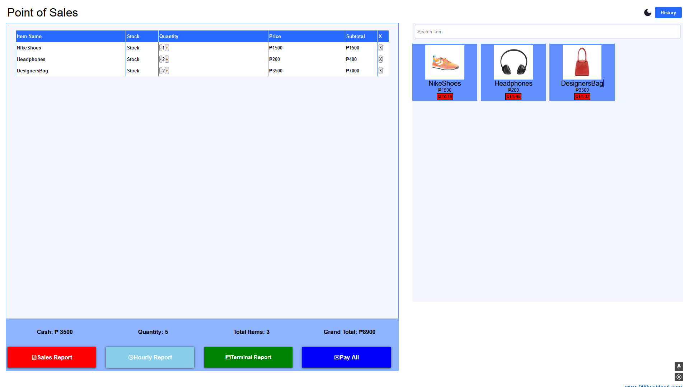
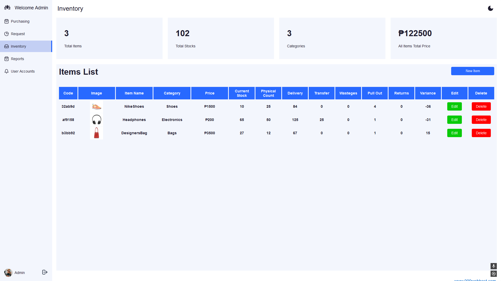

# ✨ Point of Sales and Inventory System

## 🔥 Introduction

The Point of Sales and Inventory System is a system that is made for small stores and groceries. It has plenty of features such as point of sales, inventory tracking, user roles, reporting, etc. Overall, it is a great starting system for small business and stores.

## Screenshots

## 📍 Demo

Check out the live demo of the project [Point of Sales and Inventory System](https://shimijallores.000webhostapp.com).
⚠️Note: It is not a phising website, it is flagged because i used a free hosting service because I am too broke to maintin a paid host.

## 🚀 Features

- **User Authentication:** Secure login system for users.
- **Inventory Management:** Add, update, and delete inventory items.
- **Sales Management:** Record and manage sales transactions.
- **Reporting:** Generate reports on sales, inventory levels, and more.
- **Search Functionality:** Quickly find products or sales records.
- **User Roles:** Admin and staff roles with different permissions.
- **Responsive Design:** Accessible on various devices.

## 👨‍💻 Technologies Used

- **Backend:** PHP
- **Database:** MySQL
- **Frontend:** HTML, CSS, JavaScript
- **Web Server:** Apache

### ✅ Prerequisites

- PHP 7.4 or higher
- MySQL 5.7 or higher
- Apache HTTP Server 2.4 or higher
- Composer
